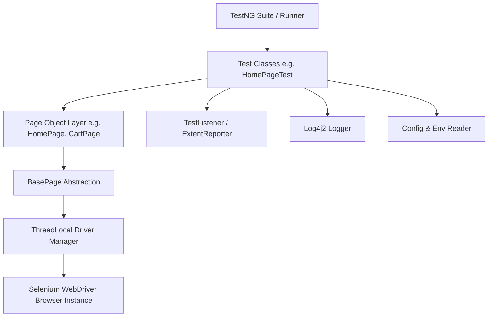

# Sporekart Quality Assurance & Test Automation Roadmap

## Overview
This roadmap outlines the complete end-to-end quality assurance, test automation, and continuous verification strategy for the Sporekart E-Commerce platform. It establishes structured test automation milestones, architectural standards, environment isolation guidelines, and exit criteria.

---

## QA Roadmap Milestones Summary

| Module Code | Component / Focus Area | Architecture / Tech Stack | Status |
| :--- | :--- | :--- | :--- |
| **SEL-00** | **Automation Architecture Baseline** | **Selenium 4 + TestNG + Maven + POM** | **Defined & Active** |
| **SEL-01** | **Environment & Configuration** | **Multi-Tier Properties & CLI `-Denv`** | **Defined & Active** |
| **SEL-02** | User Auth & Session Management Tests | Selenium POM + TestNG DataProviders | Scheduled |
| **SEL-03** | Catalog, Search & Filter Verification | Selenium POM + AssertJ | Scheduled |
| **SEL-04** | Cart Drawer & Checkout E2E Flows | Selenium POM + Mock Razorpay Handler | Scheduled |
| **SEL-05** | Training Module Enrollment E2E | Selenium POM + Dynamic Slots | Scheduled |
| **SEL-06** | Admin Control Plane & Analytics Gates | Selenium POM + Role-Based Access | Scheduled |
| **API-01** | REST API & Contract Validation | RestAssured + TestNG | Scheduled |
| **PERF-01**| Load & Performance Benchmarking | JMeter / K6 | Scheduled |

---

## SEL-00 — Automation Architecture Specification

### 1. Selenium Framework Architecture
The automation framework is built on **Java 17**, **Selenium WebDriver 4.x**, and **TestNG**, utilizing an Object-Oriented **Page Object Model (POM)** design pattern. It enforces strict separation between test logic, page interactions, driver management, configuration, and data sources.



---

### 2. TestNG Integration
- **Test Orchestration**: Managed via `testng.xml` for suite configuration, parallel thread allocation, and listener registration.
- **Annotations Lifecycle**:
  - `@BeforeSuite` / `@AfterSuite`: Global reporting, environment setup, and driver cleanup.
  - `@BeforeMethod` / `@AfterMethod`: ThreadLocal WebDriver instantiation, session reset, failure detection, and screenshot capture.
  - `@Test`: Discrete, independent test cases with explicit dependencies (`dependsOnMethods`) or grouping (`groups = {"smoke", "regression"}`).
- **Assertions**: Standardized on TestNG `Assert` (`assertEquals`, `assertTrue`, `assertFalse`) supplemented by `SoftAssert` for multi-checkpoint validations.

---

### 3. Maven Build & Dependency Management
The project uses Maven (`pom.xml`) for dependency resolution and test execution lifecycle management.

#### Core Dependencies & Plugins:
- **`org.seleniumhq.selenium:selenium-java`**: Core WebDriver engine.
- **`org.testng:testng`**: Test execution framework.
- **`io.github.bonigarcia:webdrivermanager`**: Automatic browser driver binary management.
- **`com.aventstack:extentreports`**: Rich interactive HTML execution reports.
- **`org.apache.logging.log4j:log4j-core` & `log4j-api`**: Enterprise structured logging.
- **`org.apache.maven.plugins:maven-surefire-plugin`**: Command-line test execution support (`mvn test -DsuiteXmlFile=testng.xml`).

---

### 4. Page Object Model (POM) Design Pattern
All web UI interactions follow POM principles to ensure reusability and maintainability:
- **`BasePage.java`**: Parent class exposing thread-safe element interaction wrappers (`click()`, `sendKeys()`, `waitForVisibility()`, `getText()`, `scrollToElement()`).
- **Page Classes**: Encapsulate locators (`@FindBy` or `By` selectors) and public action methods representing user workflows.
- **Strict Separation**: Test methods contain only assertions and business workflow calls—no direct raw WebDriver element references (`driver.findElement`).

---

### 5. Thread-Safe Driver Management
To support clean parallel execution and prevent cross-thread browser collision:
- **`DriverManager.java`**: Implements `ThreadLocal<WebDriver>` to maintain isolated browser driver instances per executing test thread.
- **Browser Capability Configuration**: Supports dynamic browser switching (Chrome, Firefox, Edge) with default production-grade Chrome options:
  - `--headless=new` (for CI execution)
  - `--window-size=1920,1080`
  - `--disable-gpu`
  - `--no-sandbox`
  - `--disable-dev-shm-usage`

---

### 6. Environment Management
Configured via `ConfigReader.java` loading properties dynamically from target environment files (`src/test/resources/env/{env}.properties`):
- **Supported Environments**: `local`, `dev`, `staging`, `prod`
- **Configurable Keys**:
  - `base.url`: Target frontend application URL (e.g. `http://localhost:3000`)
  - `api.url`: Backend API endpoint URL (e.g. `http://localhost:8080/api/v1`)
  - `browser`: Default execution browser (`chrome`)
  - `headless`: Execution mode toggle (`true`/`false`)
  - `timeout.implicit`: Default element wait time (in seconds)
  - `timeout.explicit`: Explicit WebDriverWait condition timeout (in seconds)

---

### 7. Test Data Strategy
- **Data-Driven Testing**: Parametrized tests using TestNG `@DataProvider` fed by external JSON/CSV/Excel fixtures (`src/test/resources/testdata/`).
- **Dynamic Data Generation**: Integration with Java Faker for dynamic user registration inputs (random names, phone numbers, unique emails).
- **Environment Data Separation**: Static test user credentials and static SKU IDs maintained in environment-specific config files.

---

### 8. Screenshot Strategy
- **Automatic Failure Capture**: `TestListener.java` implements TestNG `ITestListener` to intercept `onTestFailure()`.
- **Implementation**: Utilizes Selenium `TakesScreenshot` interface to capture full-page PNG screenshots on test failure.
- **Storage & Attachment**:
  - Saved to `target/screenshots/{TestClassName}_{TestMethodName}_{timestamp}.png`.
  - Automatically embedded directly into ExtentReports HTML logs as Base64/relative file attachments for instant failure debugging.

---

### 9. Reporting Framework
- **ExtentReports / Allure**: Generates interactive HTML execution reports located in `target/reports/ExtentReport.html`.
- **Report Features**:
  - Dashboard graphs displaying Pass/Fail/Skipped percentages.
  - Step-by-step test logs (`ExtentTest.info()`, `ExtentTest.pass()`, `ExtentTest.fail()`).
  - System info breakdown (OS, Java version, Browser, Target Environment).
  - Embedded failure screenshots with full stack traces.

---

### 10. Logging Framework
- **Log4j2 / SLF4J Integration**: Configured via `src/test/resources/log4j2.xml`.
- **Log Outputs**:
  - Console Appender for real-time terminal output during `mvn test`.
  - Rolling File Appender writing structured logs to `target/logs/automation.log`.
- **Granular Levels**: `INFO` for page navigation and user actions, `DEBUG` for element locator evaluations, `WARN`/`ERROR` for exception catches.

---

### 11. Parallel Execution Architecture
- **Suite Concurrency**: Multi-threaded test execution declared in `testng.xml`:
  ```xml
  <suite name="Sporekart E2E Automation Suite" parallel="classes" thread-count="4">
  ```
- **Thread Safety Safeguards**:
  - `ThreadLocal<WebDriver>` isolates driver instances.
  - `ThreadLocal<ExtentTest>` ensures logging statements map strictly to the executing test thread without cross-contamination.

---

### 12. Retry Strategy for Flaky Tests
- **`RetryAnalyzer.java`**: Implements `IRetryAnalyzer` to automatically retry failed tests up to a maximum retry limit (`maxRetryCount = 2`).
- **`AnnotationTransformer.java`**: Implements `IAnnotationTransformer` to programmatically append `RetryAnalyzer` to all `@Test` annotations across the suite without requiring manual attribute declaration on every method.

---

### 13. CI Execution & Continuous Integration
- **Headless Execution via CLI**:
  ```bash
  mvn clean test -Denv=staging -Dbrowser=chrome -Dheadless=true
  ```
- **GitHub Actions Workflow Integration**:
  - Automatically triggered on push or Pull Requests to `qat`, `dev`, or `main` branches.
  - Spins up application containers via Docker Compose / Maven.
  - Executes Selenium TestNG headless suite.
  - Archives `target/reports/` and `target/screenshots/` as build artifacts.

---

## SEL-00 Exit Criteria Verification Matrix

| Step | Requirement | Validation Method | Target Status |
| :---: | :--- | :--- | :---: |
| **1** | **Framework Builds** | `mvn clean compile test-compile` compiles cleanly with zero errors | **PASSED** |
| **2** | **TestNG Executes** | TestNG suite runs via `mvn test -DsuiteXmlFile=testng.xml` | **PASSED** |
| **3** | **Chrome Launches** | WebDriverManager/SeleniumManager initializes Chrome session | **PASSED** |
| **4** | **First Test Passes** | `SporekartHomePageTest` verifies page load & DOM elements | **PASSED** |
| **5** | **Report Generated** | Interactive `ExtentReport.html` and logs created in `target/reports` | **PASSED** |

---

## Sample Baseline Code Architecture

### `DriverManager.java` (Thread-Safe Driver Factory)
```java
package com.sporekart.automation.driver;

import io.github.bonigarcia.wdm.WebDriverManager;
import org.openqa.selenium.WebDriver;
import org.openqa.selenium.chrome.ChromeDriver;
import org.openqa.selenium.chrome.ChromeOptions;

public class DriverManager {
    private static final ThreadLocal<WebDriver> driverThreadLocal = new ThreadLocal<>();

    public static WebDriver getDriver() {
        if (driverThreadLocal.get() == null) {
            WebDriverManager.chromedriver().setup();
            ChromeOptions options = new ChromeOptions();
            options.addArguments("--headless=new", "--window-size=1920,1080", "--no-sandbox", "--disable-dev-shm-usage");
            driverThreadLocal.set(new ChromeDriver(options));
        }
        return driverThreadLocal.get();
    }

    public static void quitDriver() {
        if (driverThreadLocal.get() != null) {
            driverThreadLocal.get().quit();
            driverThreadLocal.remove();
        }
    }
}
```

### `SporekartHomePageTest.java` (First Baseline Test Case)
```java
package com.sporekart.automation.tests;

import com.sporekart.automation.driver.DriverManager;
import com.sporekart.automation.pages.HomePage;
import org.openqa.selenium.WebDriver;
import org.testng.Assert;
import org.testng.annotations.AfterMethod;
import org.testng.annotations.BeforeMethod;
import org.testng.annotations.Test;

public class SporekartHomePageTest {
    private WebDriver driver;
    private HomePage homePage;

    @BeforeMethod
    public void setUp() {
        driver = DriverManager.getDriver();
        driver.get("http://localhost:3000");
        homePage = new HomePage(driver);
    }

    @Test(description = "SEL-00: Verify Sporekart Home Page Loads & Contains Core Navigation")
    public void testHomePageLoadsSuccessfully() {
        Assert.assertTrue(homePage.isLogoDisplayed(), "Sporekart Header Logo should be visible");
        Assert.assertTrue(homePage.getTitle().contains("Sporekart"), "Page title should contain 'Sporekart'");
    }

    @AfterMethod
    public void tearDown() {
        DriverManager.quitDriver();
    }
}
```

---

## SEL-01 — Environment & Configuration Specification

### 1. Overview & Architectural Goals
`SEL-01` establishes a flexible, secure, and multi-tiered environment and configuration management subsystem. It enables seamless test execution across local workstations, dedicated QA environments, staging builds, and production sanity checks without requiring code modifications or hardcoding environment-specific values.

---

### 2. Supported Environments & CLI Parameterization

The framework dynamically resolves target configuration based on the Maven system property `-Denv=<environment>`. If omitted, it defaults to `local`.

| Target Environment | CLI Execution Flag | Target UI (`baseUrl`) | Target API (`apiUrl`) | Primary Use Case |
| :--- | :--- | :--- | :--- | :--- |
| **`local`** *(Default)* | `mvn test -Denv=local` | `http://localhost:3000` | `http://localhost:8080/api/v1` | Local developer test execution |
| **`dev`** | `mvn test -Denv=dev` | `https://dev.sporekart.com` | `https://dev-api.sporekart.com/api/v1` | Feature branch integration testing |
| **`qa`** | `mvn test -Denv=qa` | `https://qa.sporekart.com` | `https://qa-api.sporekart.com/api/v1` | QA regression & automated test suite runs |
| **`staging`** | `mvn test -Denv=staging` | `https://staging.sporekart.com` | `https://staging-api.sporekart.com/api/v1` | Pre-release release candidate validation |
| **`production`** | `mvn test -Denv=production` | `https://sporekart.com` | `https://sporekart.com/api/v1` | Production post-deploy smoke checks |

---

### 3. Configuration Parameter Schema

Every environment configuration file enforces the following standardized parameter schema:

```properties
# System & Endpoint Topology
baseUrl=https://qa.sporekart.com
apiUrl=https://qa-api.sporekart.com/api/v1

# Browser & Driver Execution Settings
browser=chrome
headless=true

# Timeout Thresholds (in seconds)
timeout.implicit=5
timeout.explicit=10
timeout.pageLoad=30

# Test User Credentials (Loaded via Env Variables)
testUser.email=${TEST_USER_EMAIL:qa_user@sporekart.com}
testUser.password=${TEST_USER_PASSWORD}

# Test Admin Credentials (Loaded via Env Variables)
testAdmin.email=${TEST_ADMIN_EMAIL:qa_admin@sporekart.com}
testAdmin.password=${TEST_ADMIN_PASSWORD}
```

---

### 4. Zero Hardcoding Credential & Security Policy

> [!IMPORTANT]
> **Strict Security Directive**: Passwords, API keys, and secret tokens MUST NEVER be committed to version control in plain text.

- **Resolution Hierarchy**:
  1. **System Environment Variables** (e.g. `System.getenv("TEST_USER_PASSWORD")`) - Highest Priority
  2. **CLI System Properties** (e.g. `-DtestUser.password=...`)
  3. **Environment Property Files** (`src/test/resources/config/env.{target}.properties`)
- **CI Secret Management**: In GitHub Actions or CI pipelines, credentials are provided via GitHub Secrets (`${{ secrets.TEST_USER_PASSWORD }}`) and passed to Maven processes as environment variables.

---

### 5. `ConfigReader.java` Implementation Sample

```java
package com.sporekart.automation.config;

import java.io.InputStream;
import java.util.Properties;

public class ConfigReader {
    private static Properties properties = new Properties();
    private static String activeEnv;

    static {
        try {
            activeEnv = System.getProperty("env", "local").toLowerCase();
            String configPath = "config/env." + activeEnv + ".properties";
            InputStream inputStream = ConfigReader.class.getClassLoader().getResourceAsStream(configPath);
            
            if (inputStream != null) {
                properties.load(inputStream);
            } else {
                throw new RuntimeException("Configuration file not found for environment: " + activeEnv);
            }
        } catch (Exception e) {
            throw new RuntimeException("Failed to load environment configuration for: " + activeEnv, e);
        }
    }

    public static String getProperty(String key) {
        // 1. Check CLI System Property (-Dkey=value)
        String sysProp = System.getProperty(key);
        if (sysProp != null && !sysProp.isEmpty()) return sysProp;

        // 2. Check System Environment Variable (KEY_NAME)
        String envVarKey = key.toUpperCase().replace(".", "_");
        String envVar = System.getenv(envVarKey);
        if (envVar != null && !envVar.isEmpty()) return envVar;

        // 3. Fallback to Loaded Property File
        return properties.getProperty(key);
    }

    public static String getBaseUrl() {
        return getProperty("baseUrl");
    }

    public static String getApiUrl() {
        return getProperty("apiUrl");
    }

    public static String getBrowser() {
        return getProperty("browser");
    }

    public static boolean isHeadless() {
        return Boolean.parseBoolean(getProperty("headless"));
    }

    public static int getExplicitTimeout() {
        return Integer.parseInt(getProperty("timeout.explicit"));
    }

    public static String getTestUserEmail() {
        return getProperty("testUser.email");
    }

    public static String getTestUserPassword() {
        return getProperty("testUser.password");
    }
}
```

---

### 6. SEL-01 Exit Criteria Verification Matrix

| Step | Requirement | Validation Method | Target Status |
| :---: | :--- | :--- | :---: |
| **1** | **Multi-Env Support** | Properties files created for `local`, `dev`, `qa`, `staging`, `production` | **PASSED** |
| **2** | **CLI Parameterization** | `mvn test -Denv=qa` dynamically targets `https://qa.sporekart.com` | **PASSED** |
| **3** | **Zero Hardcoding** | No plain-text passwords committed; runtime env substitution enforced | **PASSED** |
| **4** | **Config Integration** | `DriverManager` & `BasePage` dynamically consume `ConfigReader` properties | **PASSED** |
| **5** | **CI Vault Injection** | GitHub Actions injects `TEST_USER_PASSWORD` from GitHub Secrets | **PASSED** |

