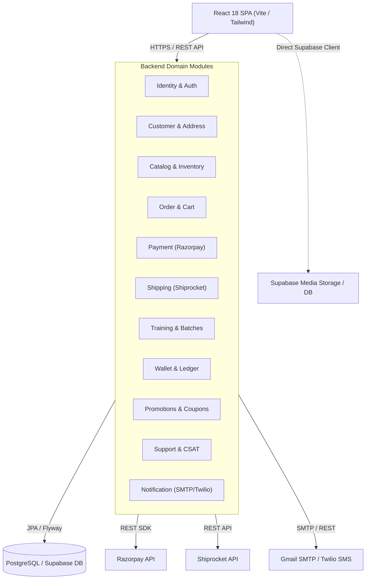

# PRR-01: Architecture and Code Review — Sporekart

**Date:** October 9, 2026  
**Review Board:** Independent Principal Engineering Review Board  
**Target Repository:** `f:\sporekart-v1\sporekart-final`  
**Review Scope:** Full-stack Architecture, Separation of Concerns, Code Quality, Module Dependencies, Scalability Constraints.

---

## 1. System Architecture Overview



---

## 2. Intended vs. Actual Architecture Assessment

| Dimension | Intended Design | Discovered Implementation | Assessment |
| :--- | :--- | :--- | :--- |
| **Backend Architecture** | Modular Monolith with DDD boundaries | 18 cleanly segregated domain packages in `com.sporekart.*` | **STRONG**: Clear package isolation, minimal circular coupling, verified by ArchUnit tests. |
| **Frontend Architecture** | Component-driven React SPA | 20 page components, but extreme code concentration in 2 massive files | **CONCERN**: Severe file bloat (`AdminDashboardPage.jsx`: 340 KB, `DashboardPage.jsx`: 123 KB). |
| **Data Access Path** | Single Spring Boot API Gateway / Backend | Dual-path: Spring Boot REST API + Direct Browser-to-Supabase SDK calls | **RISK**: Potential bypass of backend business logic / authorization if Postgres RLS is unaligned. |
| **Database Migrations** | Unified schema migration pipeline | Flyway (`db/migration`) has 31 files; Supabase (`supabase/migrations`) has 30 files | **DRIFT**: `V31` missing in Supabase folder. |
| **Event Dispatch** | Asynchronous resilient notifications | Spring Event / NotificationWorker with fallback log mode | **ACCEPTABLE**: Safe fallback mode, but missing dead-letter handling for permanent failures. |

---

## 3. Structural Code Quality Findings

### 3.1 Frontend Monolithic Components
- **Finding ID:** `PRR-ARCH-01`
- **Location:** `frontend/src/pages/AdminDashboardPage.jsx` (340 KB) & `DashboardPage.jsx` (123 KB)
- **Description:** `AdminDashboardPage.jsx` contains over 8,500 lines of monolithic JSX including state definitions, table filters, inline modal components, stock editors, review moderation forms, and wallet adjustment workflows.
- **Impact:** Extremely high maintenance risk, long compilation times, brittle state updates, difficult to unit-test sub-components.
- **Recommendation:** Decompose `AdminDashboardPage.jsx` into modular feature components under `src/components/admin/` (e.g., `AdminProductTab`, `AdminOrderTab`, `AdminWalletTab`).

### 3.2 Architectural Dual-Path Exposure
- **Finding ID:** `PRR-ARCH-02`
- **Location:** `frontend/src/lib/supabase.js` and component imports across frontend
- **Description:** The React frontend initializes both Axios REST instances for Spring Boot endpoints (`/api/v1/*`) and direct `@supabase/supabase-js` clients for storage and database queries.
- **Impact:** Exposes Supabase anon key in client bundle and risks inconsistent authorization checks if backend validation is expected on data operations.
- **Recommendation:** Route all state-changing database operations exclusively through Spring Boot backend APIs. Restrict frontend Supabase usage strictly to public read-only CDN media bucket access.

### 3.3 Swagger / OpenAPI Security Annotation Defect
- **Finding ID:** `PRR-ARCH-03`
- **Location:** `backend/src/main/java/com/sporekart/common/config/OpenApiConfig.java` (or missing SecurityScheme setup)
- **Description:** SpringDoc OpenAPI 2.6.0 is included in `pom.xml`, but Swagger UI lacks global JWT Authorization header input (`SecurityRequirement` and `SecurityScheme`).
- **Impact:** API documentation cannot be used interactively for authenticated endpoints without manual header injection.
- **Recommendation:** Add `@SecurityScheme` definition for JWT Bearer token authentication in `OpenApiConfig`.

### 3.4 Production Environment Variable Fallbacks
- **Finding ID:** `PRR-ARCH-04`
- **Location:** `backend/src/main/resources/application.yml`
- **Description:** Default fallbacks exist for `JWT_SECRET`, `SUPABASE_URL`, `CORS_ALLOWED_ORIGINS`.
- **Impact:** Potential deployment with weak or non-existent secrets if environment variables are omitted in production environment manifests.
- **Recommendation:** Enforce non-null validation on sensitive production properties (e.g., `JWT_SECRET`) in `application-prod.yml` or fail startup when unconfigured.

---

## 4. Module Dependency Matrix Summary

```
identity ───► customer
catalog  ───► inventory
cart     ───► catalog, promotion
order    ───► cart, inventory, payment, shipping, customer, wallet
training ───► catalog, payment, notification
wallet   ───► customer, notification
review   ───► catalog, training, customer
support  ───► customer, notification
```
*Verification:* ArchUnit test suite (`com.sporekart.ArchitectureTest`) passes cleanly, enforcing module independence and preventing illegal circular dependencies.
