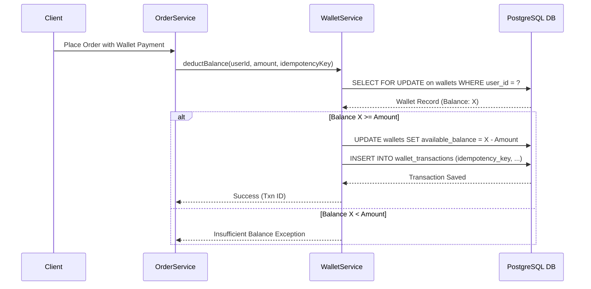

# PRR-03: Database & Data Integrity Audit — Sporekart

**Date:** October 9, 2026  
**Review Board:** Database Architect & Data Integrity Specialist  
**Target Repository:** `f:\sporekart-v1\sporekart-final\backend`  

---

## 1. Schema & Migration Integrity Assessment

### 1.1 Migration Pipeline Comparison
- **Flyway Migrations (`backend/src/main/resources/db/migration/`):** 31 SQL files (`V1__init_schema.sql` through `V31__add_sms_notification_fields.sql`).
- **Supabase Migrations (`backend/supabase/migrations/`):** 30 SQL files (`20261008000001` through `20261008000030`).
- **Defect ID:** `DB-DRIFT-01` (P1 - High / Release Blocker)
- **Description:** Migration script `V31__add_sms_notification_fields.sql` exists in Flyway resources but is **missing** from `backend/supabase/migrations/`.
- **Impact:** Deployments executed via Supabase CLI will omit SMS status and provider tracking columns (`sms_status`, `sms_provider_message_id`, `sms_error_message`), leading to SQL runtime exceptions (`column notification_events.sms_status does not exist`) when sending SMS notifications.

---

## 2. Table, Constraint, and Referential Integrity Audit

| Table Name | Primary Key | Foreign Keys | Unique Constraints | Database-Level CHECK Constraints | Risk / Audit Note |
| :--- | :--- | :--- | :--- | :--- | :--- |
| `users` | UUID (`uuid_generate_v4()`) | None | `phone`, `email` | None | Clean constraint setup. |
| `products` | UUID | `category_id REFERENCES categories(id) ON DELETE SET NULL` | `slug` | None | Good slug uniqueness. |
| `product_variants` | UUID | `product_id REFERENCES products(id) ON DELETE CASCADE` | `sku` | `price_inr >= 0`, `stock_quantity >= 0` missing at DB level | Relying on Java validator. DB CHECK constraint recommended. |
| `orders` | UUID | `user_id REFERENCES users(id) ON DELETE SET NULL` | `order_number` | None | Session ID & Shipping Address stored as TEXT/JSONB. |
| `order_items` | UUID | `order_id REFERENCES orders(id) ON DELETE CASCADE`, `variant_id REFERENCES product_variants(id) ON DELETE SET NULL` | None | `quantity > 0` | Historical prices frozen per order line item. |
| `wallets` | UUID | `user_id` (UNIQUE) | `user_id` | **Missing DB CHECK (`available_balance >= 0`)** | **P1 RISK**: Concurrency race condition could allow negative balance if Java check is bypassed. |
| `wallet_transactions` | UUID | `wallet_id REFERENCES wallets(id) ON DELETE CASCADE` | `transaction_reference`, `idempotency_key` | None | Audit ledger correctly enforces UNIQUE `idempotency_key`. |
| `enrollments` | UUID | `user_id REFERENCES users(id)`, `course_id REFERENCES courses(id)`, `batch_id REFERENCES batches(id)` | `(user_id, batch_id)` (Unique in application logic) | None | Verified unique constraint on enrollment. |

---

## 3. Financial & Wallet Ledger Integrity Verification

- **Idempotency Enforcement:** `wallet_transactions.idempotency_key` has a `UNIQUE` index in PostgreSQL. Replayed wallet credit/debit requests with identical keys are rejected by DB constraint.
- **Missing Database Check Constraint (Defect ID: `DB-VAL-01`):** `wallets` table should include `CONSTRAINT check_wallet_non_negative CHECK (available_balance >= 0)` to guarantee financial integrity at the database layer.

---

## 4. Required Database Remediation Actions

1. **Copy `V31__add_sms_notification_fields.sql` to `backend/supabase/migrations/20261008000031_v31__add_sms_notification_fields.sql`** to eliminate schema drift.
2. **Add DB-level CHECK constraint on `wallets` (`available_balance >= 0`)** via a new migration (`V32`).
3. **Add secondary composite index on `orders(user_id, created_at DESC)`** for high-performance order history pagination.
