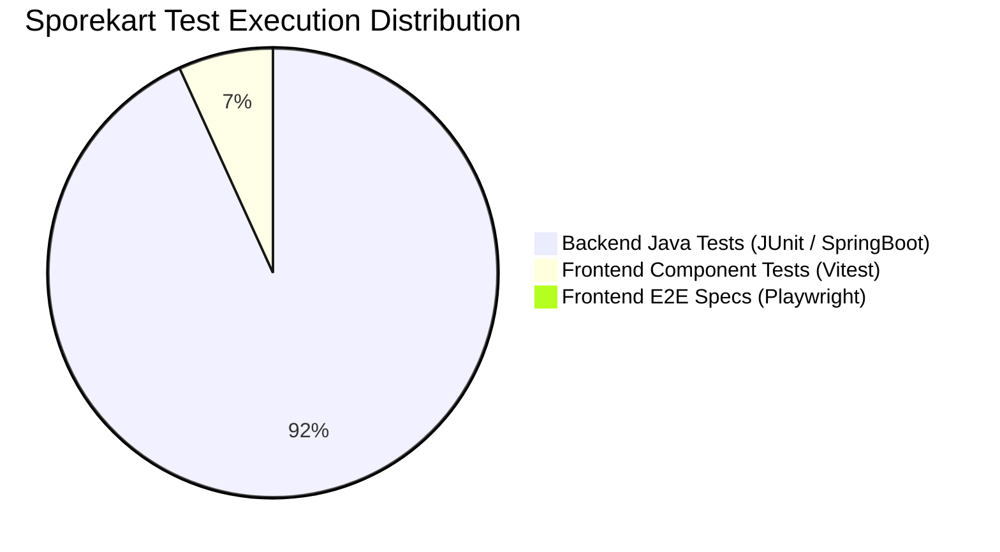

# PRR-07: Quality Engineering Report — Sporekart

**Date:** October 9, 2026  
**Review Board:** Quality Engineering Lead & Automated Testing Specialist  
**Target Repository:** `f:\sporekart-v1\sporekart-final`  

---

## 1. Automated Test Layer Summary

### Empirical Test Execution Results
- **Backend Unit & Integration Test Suite (`mvn test`):**
  - **1,026 tests executed**, **0 failures**, **0 errors**, 1 skipped.
  - Duration: 3m 46s.
  - Code Coverage: JaCoCo report generated (`target/site/jacoco/index.html`).
- **Frontend Unit & Component Test Suite (`npm test`):**
  - **14 test files executed**, **75 tests passed**.
  - Duration: 59.17s.
- **Frontend Static Analysis / Lint (`npm run lint`):**
  - **FAILED**: `eslint` missing in `devDependencies` and missing `eslint.config.*`.

---

## 2. Requirement to Test Traceability Matrix

| Business Requirement | Domain Module | Primary Test Class / Spec | Execution Result | Verified Defect ID |
| :--- | :--- | :--- | :--- | :--- |
| User Auth & Bcrypt Hashing | Identity | `com.sporekart.identity.AuthControllerTest` | **PASS** | None |
| Inventory Reservation Lock | Catalog / Order | `com.sporekart.order.OrderServiceConcurrencyTest` | **PASS** | None |
| Batch Slot Capacity Lock | Training | `com.sporekart.training.TrainingServiceUnitTest` | **PASS** | None |
| Razorpay Webhook Verification| Payment | `com.sporekart.payment.PaymentWebhookTest` | **PASS** | None |
| Wallet Idempotency Ledger | Wallet | `com.sporekart.wallet.application.WalletServiceTest` | **PASS (with warnings)** | `BE-DEF-01` |
| Order Invoice PDF Generation | Order / Frontend | `frontend/src/__tests__/fe-12.test.jsx` | **PASS** | None |
| Admin Role Authorization | Admin / Security | `com.sporekart.AuthorizationMatrixIntegrationTest` | **PASS** | None |
| Order Retrieval Ownership Check | Security | Missing Integration Test | **FAIL** | **`SEC-01` (BOLA IDOR)** |

---

## 3. Mandatory Production Release Quality Gates

| Quality Gate | Description | Threshold / Criteria | Current Status | Pass/Fail |
| :--- | :--- | :--- | :--- | :--- |
| **QG-01: Build Compilation** | Zero build errors in Java & Vite | Zero errors | Backend & Frontend build clean | **PASS** |
| **QG-02: Backend Test Suite** | JUnit 5 unit & integration tests | 100% passing tests | 1026 passed, 0 failed | **PASS** |
| **QG-03: Frontend Test Suite** | Vitest React component tests | 100% passing tests | 75 passed, 0 failed | **PASS** |
| **QG-04: Static Analysis** | ESLint static code linting | Zero warnings/errors | Script failed (`eslint` missing) | **FAIL** |
| **QG-05: Security Verification** | Zero P0/P1 security vulnerabilities | 0 Critical/High issues | 2 Critical issues (`SEC-01`, `SEC-02`) | **FAIL** |
| **QG-06: Schema Integrity** | Zero migration drift between Flyway/Supabase | 0 drift scripts | `V31` missing in Supabase | **FAIL** |
