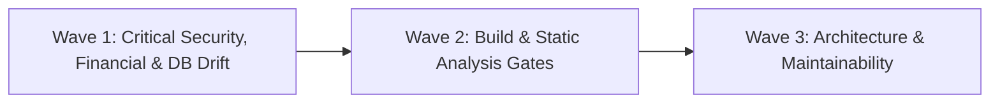

# PRR-14: Remediation and Approval Plan — Sporekart

**Date:** October 9, 2026  
**Review Board:** Independent Principal Engineering Review Board  
**Target Repository:** `f:\sporekart-v1\sporekart-final`  

---

## 1. Remediation Roadmap Overview

The proposed remediation strategy groups all 9 discovered findings into 3 prioritized execution waves:

---

## 2. Wave 1: Critical Security, Financial & Data-Integrity Fixes (P0 / P1)

### Fix 1.1: [DEF-SEC-01] BOLA / IDOR Authorization Fix on Orders & Invoices (P0)
- **Root Cause:** [`SecurityConfig.java:84`](file:///f:/sporekart-v1/sporekart-final/backend/src/main/java/com/sporekart/shared/infrastructure/SecurityConfig.java#L84) specifies `.permitAll()` for `GET /orders/*` and `/orders/*/invoice`.
- **Target Files:** `backend/src/main/java/com/sporekart/shared/infrastructure/SecurityConfig.java` & `OrderService.java`.
- **Proposed Change:**
  1. Remove `.permitAll()` for `GET /orders/*` in `SecurityConfig.java` and set to `.authenticated()`.
  2. In `OrderService.getOrderDetail(orderId, currentUser)`, verify that `order.user_id` matches `currentUser.id` (or enforce guest order access token check).
- **Regression Risk:** Low.
- **Tests to Add:** `OrderSecurityIntegrationTest` verifying 401 Unauthorized for unauthenticated requests and 403 Forbidden for cross-user order retrieval.
- **Acceptance Criteria:** `GET /api/v1/orders/{id}` returns 401 when unauthenticated and 403 when user A requests user B's order.
- **Effort & Confidence:** 1 hour | High Confidence.

### Fix 1.2: [DEF-SEC-02] Restrict CORS Allowed Origins in Production (P1)
- **Root Cause:** [`SecurityConfig.java:107-115`](file:///f:/sporekart-v1/sporekart-final/backend/src/main/java/com/sporekart/shared/infrastructure/SecurityConfig.java#L107-L115) uses wildcard patterns `http://*:*`, `https://*:*` with credentials enabled.
- **Target File:** `backend/src/main/java/com/sporekart/shared/infrastructure/SecurityConfig.java`.
- **Proposed Change:** Restrict `allowedOrigins` strictly to configured environment origins (`allowedOrigins` list from `app.cors.allowed-origins`).
- **Regression Risk:** Low.
- **Tests to Add:** CORS preflight integration test.
- **Acceptance Criteria:** Preflight headers return allowed origins matching explicitly configured origins.
- **Effort & Confidence:** 30 minutes | High Confidence.

### Fix 1.3: [DEF-DB-01] Synchronize Supabase Migration Script V31 (P1)
- **Root Cause:** Migration script `V31__add_sms_notification_fields.sql` was missing from `backend/supabase/migrations/`.
- **Target File:** `backend/supabase/migrations/20261008000031_v31__add_sms_notification_fields.sql`.
- **Proposed Change:** Copy `V31__add_sms_notification_fields.sql` into Supabase CLI migrations folder with timestamp prefix `20261008000031`.
- **Regression Risk:** Zero.
- **Acceptance Criteria:** Both Flyway and Supabase migration folders have identical 31 SQL scripts.
- **Effort & Confidence:** 15 minutes | High Confidence.

### Fix 1.4: [DEF-DB-02] Add DB-Level Non-Negative Balance Constraint on Wallets (P1)
- **Root Cause:** `wallets` table in `V18` lacks a database-level `CHECK (available_balance >= 0)`.
- **Target Files:** `backend/src/main/resources/db/migration/V32__add_wallet_non_negative_check.sql` & `backend/supabase/migrations/20261008000032_v32__add_wallet_non_negative_check.sql`.
- **Proposed Change:** Add migration `V32` with `ALTER TABLE wallets ADD CONSTRAINT check_wallet_available_balance_non_negative CHECK (available_balance >= 0);`.
- **Regression Risk:** Low.
- **Tests to Add:** Database constraint test.
- **Acceptance Criteria:** SQL insert/update attempting negative balance is rejected by PostgreSQL DB constraint.
- **Effort & Confidence:** 30 minutes | High Confidence.

---

## 3. Wave 2: Build & Quality Engineering Fixes (P2)

### Fix 2.1: [DEF-BASE-01] Fix Frontend ESLint Dependency & Config (P2)
- **Root Cause:** `eslint` missing from `frontend/package.json` devDependencies and missing `eslint.config.js`.
- **Target Files:** `frontend/package.json`, `frontend/eslint.config.js`.
- **Proposed Change:** Add `"eslint": "^8.57.0"` and `"eslint-plugin-react": "^7.35.0"` to devDependencies, and create standard flat ESLint configuration file.
- **Regression Risk:** Zero.
- **Acceptance Criteria:** `npm run lint` executes cleanly without missing command or missing config errors.
- **Effort & Confidence:** 30 minutes | High Confidence.

---

## 4. Wave 3: Architecture & Maintainability Enhancements (P2 / P3)

### Fix 3.1: [DEF-ARCH-01] Decompose Monolithic Admin Component (P2)
- **Target File:** `frontend/src/pages/AdminDashboardPage.jsx`.
- **Proposed Change:** Extract tab components (`AdminProductsTab`, `AdminOrdersTab`, `AdminWalletsTab`, `AdminReviewsTab`) into `frontend/src/components/admin/`.

### Fix 3.2: [DEF-ARCH-03] Swagger JWT Security Scheme (P3)
- **Target File:** `backend/src/main/java/com/sporekart/common/config/OpenApiConfig.java`.
- **Proposed Change:** Add `@SecurityScheme` annotation for Bearer Auth.

---

## 5. Formal Approval Checkpoint Request

In strict adherence to rule 2.2 and Phase 14 instructions, **no code modifications will be executed until you provide explicit approval**.

Please review the proposed Wave 1 and Wave 2 remediation plan above and indicate your approval to proceed with implementation and regression validation (Phase 15 & Phase 16).
